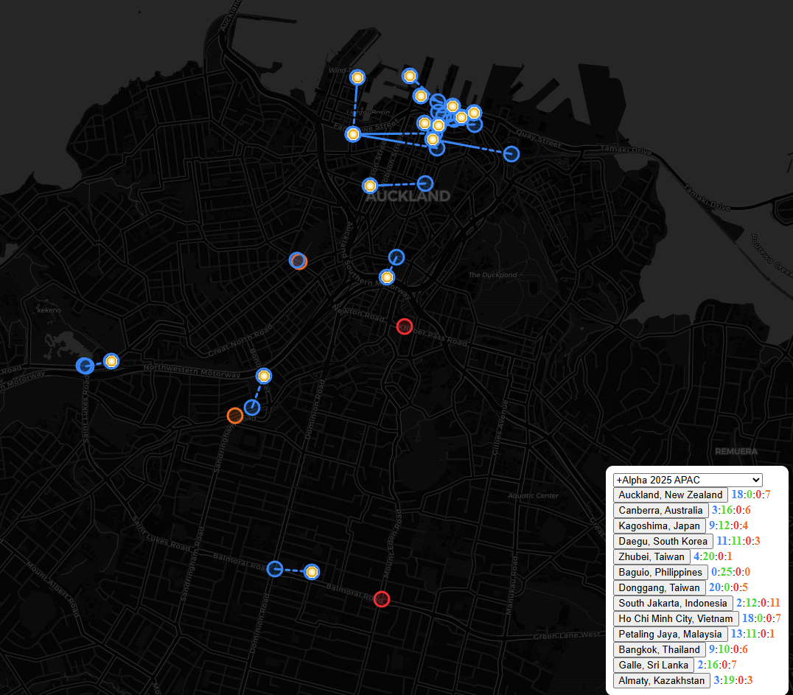

# shards

Leaflet map of Ingress shard jump JSON

Distances are calculated with the [Haversine formula](https://rosettacode.org/wiki/Haversine_formula), using the Mean Earth Radius (6371km).

The colour of each portal is based on the last relevant action which occurred at that portal. This is either:

-   The same colour of the last link which the shard jumped along.
-   The colour of the portal when the shard spawned (may be neutral).

Portal alignment at the time a shard despawns is deemed to be not relevant for display, however it is included in the history (hover over portal).

## Adding data to project

In order to ensure that new data is included on the shard map, the following configuration changes are required to the project:

-   For a new series, add a new entry in _conf/series_metadata.json_. See other entries for example properties available.
    -   Is it preferable to use the same series ID as Niantic use i.e. 2025-plusbeta for the +Beta series.
    -   Adding a new entry will update the _conf/series_geocode.json_ file - please don't change it manually!
-   For new shard jump data, enter it in the relevant series folder in _data_. For example, the +Beta series files are located in _data/2025-plusbeta_.
    -   The jump files with a prefix of 'shard-jump-times-' will be automatically parsed and shards will be matched to the site (and date) within the series.
